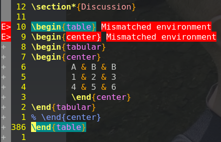

+++
title = "Latex Flow"
date = 2022-02-04
[taxonomies]
categories = ["Latex"]
tags = ["info"]
[extra]
author = "Erik Rose"

+++

# Latex - Better Than Reinventing the Wheel

## Better Than Reinventing the Wheel

Latex first entered onto my radar in graduate school as research papers began to strain my relationship with MS Word. First I used a number of desktop publishing programs, starting with Adobe InDesign and trying a few open source alternatives, and these options offer better presentation, but at the cost of program size and complexity.  Support for features like auto-numbering figures and tables was non-existent, making it an ultimate non-starter for research.  When I poked around on the internet looking for what other people used to draft and edit their thesis, Latex came up multiple times. "This is what the professionals use" I thought, and resolved to figure it out.

My first negative impression was not struggling to get it to compile (that would come later). Rather, the verbosity and boilerplate quality of the syntax immediately put me off, in the same way that seeing the html tags add a level of visual complexity that can make it hard to follow the content on a website. It wasn't the complexity, though, so much as the extra typing that really stuck in my craw. I flirt enough with RSI as it is. These notes are the changes that I made to my development environment to reduce computer-related stress by minimizing the need for repetitive typing and mouse-use.

Features of this setup include:
 * autocompletion for frequently-used code blocks
 * syntax checking for paired braces etc.
 * spell-checking and syntax highlighting


# Editor

Previously I used RStudio for R and IntelliJ for everything else code related. These programs are feature rich, but bloated and heavy, consuming significant amounts of RAM. Latex editors that I tried, including Scribus, are light-weight but not feature-rich enough. NeoVim is a current iteration of the storied Vim text editor, modernized to include many of the features of IntelliJ, VSCode and other IDEs, while remaining light-weight, responsive and powerful. Vim works very differently from other text editors, and this can be a good thing, but the lack of common ground with prior experience can slow down the learning process, especially at first.  I recommend the article [Learn Vim for the Last Time](https://danielmiessler.com/study/vim/) by Daniel Miessler.

Instead of a settings menu, Vim uses a configuration file, allowing maximum flexibility in customization. But if you are not used to mucking around in configuration files, getting your config file just right will take trial and error. On my system with Neovim, the location in is ~/.config/nvim/init.vim. Learning to use the default configuration is helpful when you are working on new or random machines, but selective customization is key to an ergonomic and productive flow.

# Plugins

The preamble of my init.vim file is the plugin invocation. Plugins extend the functionality of Vim for specific use cases. The [vim-plug](https://github.com/junegunn/vim-plug) plugin manager is popular and works without issue on my machine, and should also work on MacOS according to [this article](https://dev.to/dafloresdiaz/neovim-for-macos-3nk0). The most relevant plugins for my latex workflow are [vim-tex](https://github.com/lervag/vimtex) for compiling tex files to pdfs and displaying them in a viewer, [ultisnips](https://github.com/SirVer/ultisnips) for snippet completion, and [vim-lsp](https://github.com/prabirshrestha/vim-lsp) for syntax checking.

Using [vim-plug](https://github.com/junegunn/vim-plug) requires separate installation, although you should be able to copy and paste the necessary commands for your system from the instructions on the github site into your terminal. Once installed, use the following code at the start of init.vim to invoke the plugin manager and install the specified plugins.

```vim
" plugin manager junegunn/vim-plug
call plug#begin('~/.vim/plugged')

" language server protocal
Plug 'prabirshrestha/vim-lsp'
Plug 'mattn/vim-lsp-settings' " Installation helper
Plug 'neovim/nvim-lspconfig'

" text editing
Plug 'SirVer/ultisnips' " snippet engine
Plug 'lervag/vimtex' " compile and display latex
Plug 'tpope/vim-surround' " hotkeys for surrounding tags and braces

call plug#end()
```

The first time starting Vim up, run `:PlugInstall` from command mode to download and install the plugins on your machine. Remember to run this command again if you add a new plugin to the list at a later time.

The first time opening a file in .tex format, Vim will prompt you to install the Latex language server using the command `:LspInstallServer`. This is a helper function provided by the [vim-lsp-settings](https://github.com/mattn/vim-lsp-settings) plugin, and requires the vim-lsp plugin to also be present. Confirm [Y] for installation. The plugin is a one-stop-shop for programming languages, and will prompt the user when a new server is available that supports a given file type. Most of the features available are for programming. The tab completion features of [nvim-lspconfig](https://github.com/neovim/nvim-lspconfig) are of debatable value here, but it is part of my overall setup.

The real value contribution is from syntax checking, which prints compilation errors to the screen in real time, allowing the user to catch common syntax errors as they occur, rather than at compilation time. In the example figure, I have commented out the closing center block, and the language server helpfully informs me I have mismatching environments. This is also useful for catching missing braces, and other common formatting errors. 



# Keymapping

The following lines are a curated selection from config files I found on the web. The comments above indicate the intended effect.
